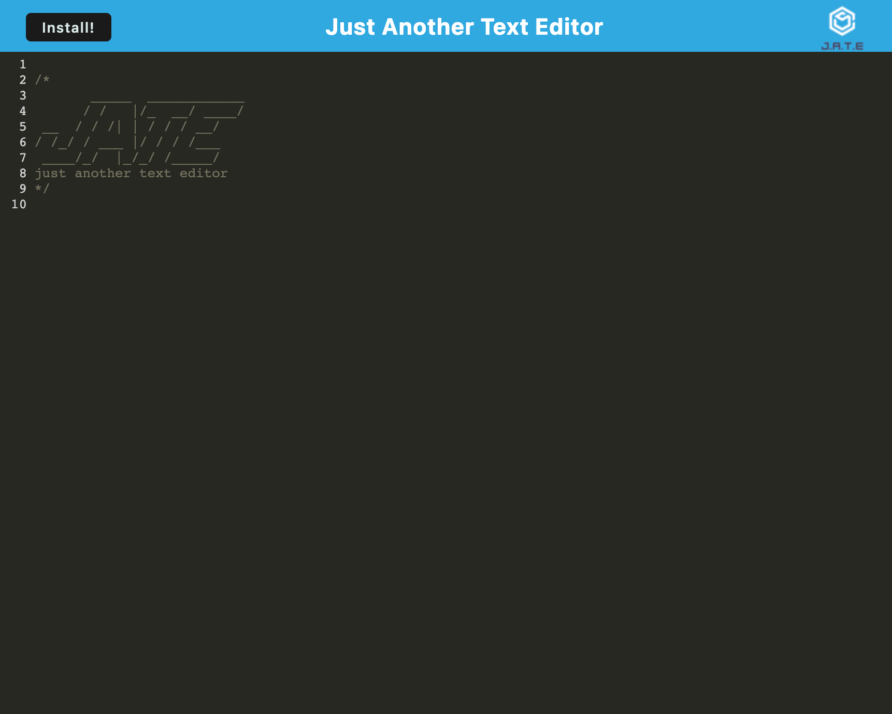

# Ultimate-textEditor-PWA

## Description
This application takes an existing text editor app and adds functionality for it to work as a PWA and function offline. It allows the page to be downloaded as a desktop application for it to be used in offline mode. This application is deployed through Heroku.

## Table of Contents
- [Link](#Link)
- [Screenshot](#Screenshot)
- [Installation](#installation)
- [Usage](#usage)
- [Technologies](#technologies)
- [License](#license)
- [Tests](#tests)
- [Credits](#credits)
- [Contribution](#how-to-contribute)
- [Contact / Questions](#contact--questions)

## Link
Heroku deployed link: [Ultimate-textEditor-PWA](https://ultimate-texteditor-pwa.herokuapp.com/)

## Screenshot

## Installation
To install this app, simply clone the repo to your local machine. 
Then in the CLI at relative dir run 'npm i' to install all 
dependancies required to sucessfully run the app.

## Usage (Instructions/How-To Use)
To use the package, run 'npm start', to run the site as a local host.

To use link, click on the live link above, to run the program on the browser or click 'install' to run program offline.

## Technologies
JavaScript, Node.js, Express.js, Webpack,IDB, Babel.

## License
This project is licensed under the MIT license. For more 
information about this license and what it entails, visit the MIT 
website <a href="https://opensource.org/licenses/MIT">here</a>

Preview:

    Permission is hereby granted, free of charge, to any person 
    obtaining a copy of this software and associated documentation 
    files (the “Software”), to deal in the Software without 
    restriction, including without limitation the rights to use, 
    copy, modify, merge, publish, distribute, sublicense, and/or 
    sell copies of the Software, and to permit persons to whom the 
    Software is furnished to do so, subject to the following 
    conditions:

    The above copyright notice and this permission notice shall be 
    included in all copies or substantial portions of the Software.

    THE SOFTWARE IS PROVIDED “AS IS”, WITHOUT WARRANTY OF ANY 
    KIND, EXPRESS OR IMPLIED, INCLUDING BUT NOT LIMITED TO THE 
    WARRANTIES OF MERCHANTABILITY, FITNESS FOR A PARTICULAR 
    PURPOSE AND NONINFRINGEMENT. IN NO EVENT SHALL THE AUTHORS OR 
    COPYRIGHT HOLDERS BE LIABLE FOR ANY CLAIM, DAMAGES OR OTHER 
    LIABILITY, WHETHER IN AN ACTION OF CONTRACT, TORT OR 
    OTHERWISE, ARISING FROM, OUT OF OR IN CONNECTION WITH THE 
    SOFTWARE OR THE USE OR OTHER DEALINGS IN THE SOFTWARE.

## Tests
Tests on the application have been completed with Lighthouse -- an applications tab in Chrome Dev Tools -- to ensure all items store properly and cache is accepted.

## Credits
<li><strong><a href="https://github.com/alc0ve" 
target="_blank">Christina Hall</a>:</strong> Full-Stack Developer</
li> 
<li><strong><a href="https://github.com/blairrrrwho" 
target="_blank">Blair Millot</a>:</strong> Full-Stack Developer</
li>  
<li>Vincent Teune - Teacher Assistant, helped with some code and 
problems.</li>
<li>Vinnie Lopez - Tutor, helped with some code and problems.</li>
<li>AskBCS - Learning Assistant, helped with some code and 
problems.</li>

## How to Contribute
Fork the repo and clone down to your local machine. Once you have 
the latest version of the repo, you can add or make changes then 
submit a pull request for your changes. Please use best practices 
as well as proper naming conventions and comments depicting what 
the code segements function is. Finally in the body of your pull 
request, please explain why these changes you were necissary and 
if it is a bug what steps can be completed to reproduce this bug. 
If these guidelines are not met, pull requests will not be 
reviewed or accepted.

## Contact / Questions
If you liked this project and want to see more, feel free to check 
out my other repos [here](https://github.com/tlequernaque).  
For any questions or inquiries, you can reach me at t.
lequernaque@yahoo.com.com for further information.    

<li><strong><a href="https://github.com/tlequernaque" 
target="_blank">Terry Lequernaque</a>:</strong> Full-Stack 
Developer</li>  

- - - - 
© 2023 Ultimate-textEditor-PWA, Inc. All Rights Reserved.